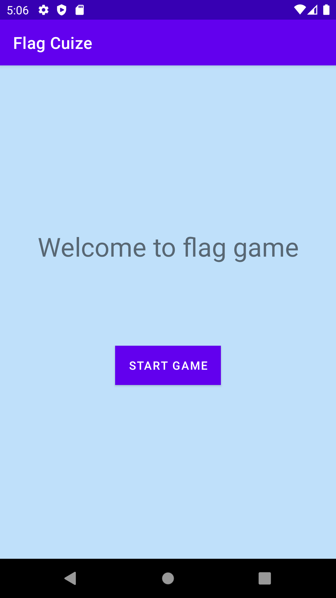
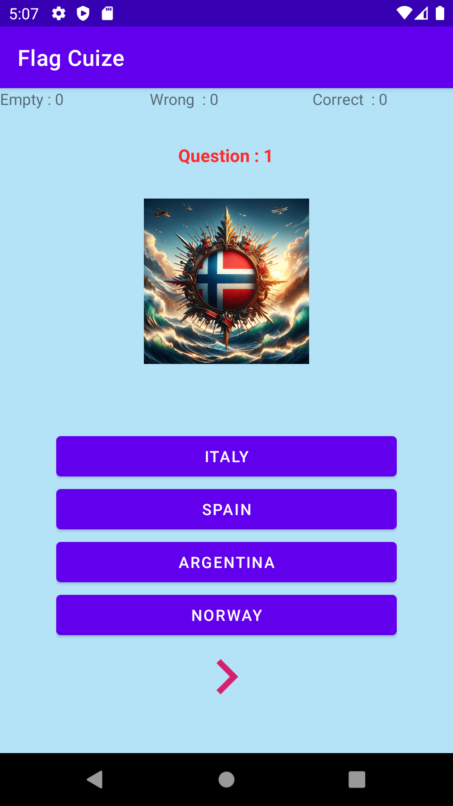
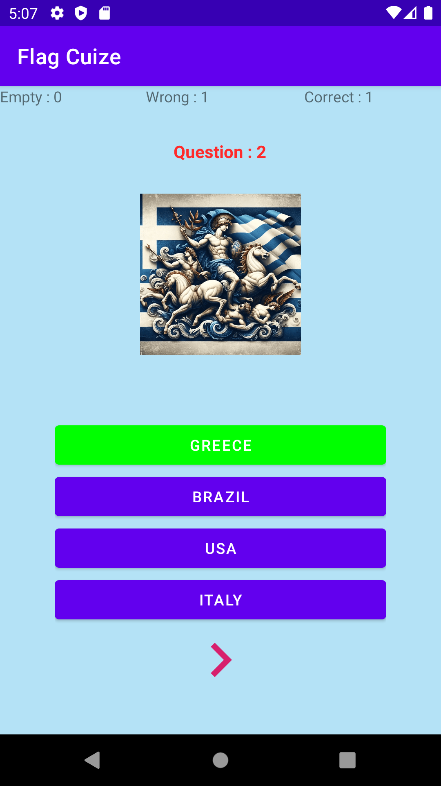
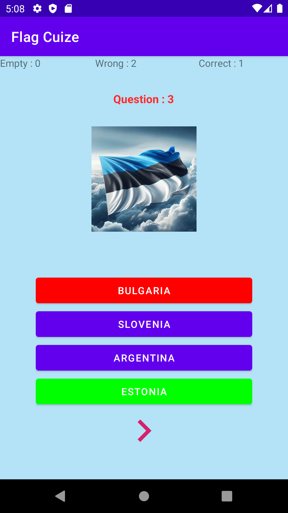
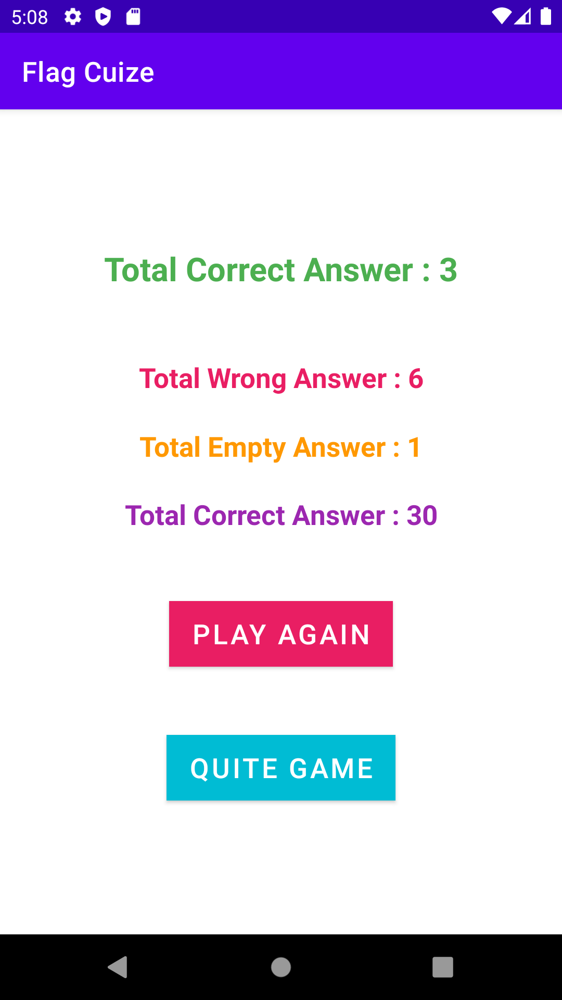

# Country Flag Quiz Android App

A simple Android quiz app that tests your knowledge of countries based on their flags.

## Features

- Display a flag and multiple choice options for each question.
- Keep track of correct, wrong, and empty answers.
- Display the final score after 10 questions.

## Screenshots

## Installation

1. Clone this repository.
2. Open the project in Android Studio.
3. Build and run the app on an Android emulator or physical device.

## Usage

- Start the app and answer the quiz questions.
- After 10 questions, the app will display your final score.

## Contributing

Contributions are welcome! Feel free to open issues or pull requests.

## License

This project is licensed under the [MIT License](LICENSE).
